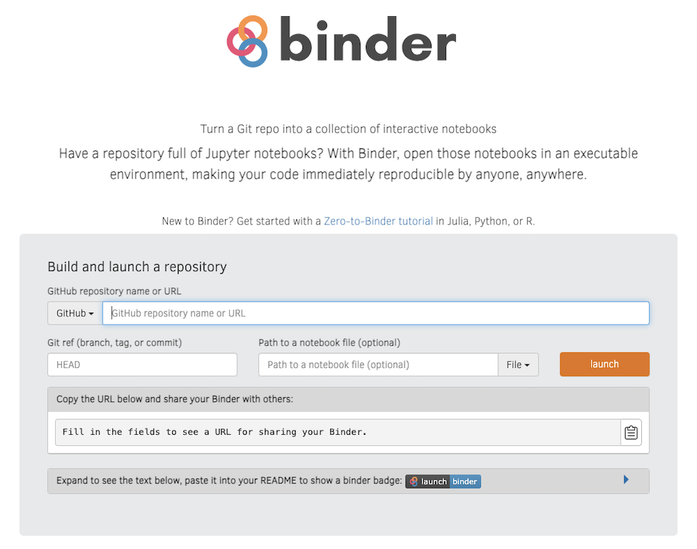
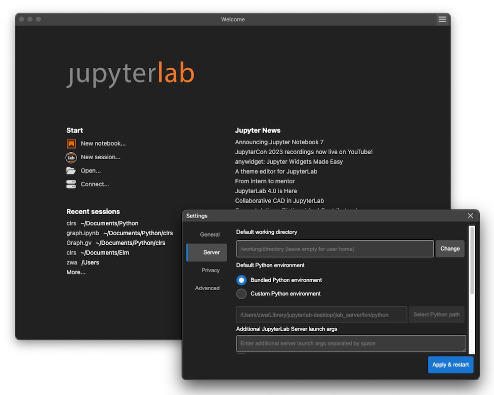

# clrs

## *Jupyter notebooks for CLRS algorithms*

This project provides implementations of, and commentaries on, some of the interesting algorithms described in the well known textbook [*Introduction to Algorithms*](https://www.amazon.com/Introduction-Algorithms-fourth-Thomas-Cormen/dp/026204630X) by Professors Cormen, Leiserson, Rivest, and Stein (CLRS 4ed 2022; formerly CLR 1ed 1990). The Python implementations and the associated commentaries are presented as [Jupyter](https://www.amazon.com/Introduction-Algorithms-fourth-Thomas-Cormen/dp/026204630X) notebook interactive documents.

The main purpose here is to show how to convert the English descriptions of algorithms given in CLRS into *code* and how to use the theorems, lemmas, corollaries, and other mathematical properties proven therein to implement *test* cases for the code. That is, the aim is not to provide a comprehensive implementations of CLRS algorithms, but to focus on the process of closely reading a mathematical textbook like this, following its arguments and proofs, converting algorithm text into code, and testing the implementations against proven mathematical properties.

Jupyter is chosen for its excellent [literate programming](https://en.wikipedia.org/wiki/Literate_programming) environment that produces documents containing both mathematical text and runnable code. Python is chosen because it is one of the most comprehensible programming languages. It is fairly succinct, has a reasonably small syntactic constructs, and possesses relatively few quirks. But more importantly, it is an imperative language. Most textbooks, including CLRS, present decidedly imperative algorithms.

Just because an algorithm is recursive does not make it functional. The imperativeness shines through, whenever it mutates the data structures it accepts as input arguments. To my knowledge, there is but one textbook written from the functional perspective: [*Purely Functional Data Structures*](https://www.amazon.com/Purely-Functional-Data-Structures-Okasaki/dp/0521663504/ref=sr_1_1?keywords=purely+functional+data+structures&qid=1690905795&sprefix=purely+functional+%2Caps%2C81&sr=8-1), Okasaki 1999. I heartily recommend this textbook to anyone interested in [functional programming](https://en.wikipedia.org/wiki/Functional_programming)—in the academic sense of the phrase, not necessarily as it is practised in the IT industry.

The primary audience of this project is the undergraduate Computer Science students taking algorithms, especially those using CLRS. The secondary audience is the IT practitioners interested in algorithm design, analysis, and implementation.

This is an ongoing project. The first "commit" consists of graph representation, elementary graph algorithms, and two applications presented in Chapter 20 of CLRS. More implementations and commentaries will be added, incrementally.

# CONTENTS

## *IPython*

- [`util.ipynb`](./util.ipynb)—utility types and functions
  - [`graph.ipynb`](./graph.ipynb)—graph representation, BFS, and DFS from Chapter 20
    - [`graphtest.ipynb`](./graphtest.ipynb)—tests of BFS and DFS algorithms with visualisations
    - [`mst.ipynb`](./mst.ipynb)—Kruskal's and Prim's MST algorithms from Chapter 21
      - [`msttest.ipynb`](./msttest.ipynb)—tests of MST algorithms with visualisations
      - [`ssp.ipynb`](./ssp.ipynb)—Bellman-Ford and Dijkstra's SSP algorithms from Chapter 22
        - [`ssptest.ipynb`](ssptest.ipynb)—tests of SSP algorithms with visualisations

The `graph.ipynb` Jupyter notebook is where to start reading about graph algorithms.

## *Python*

- `src/util.py`—utility types and functions
  - `src/graph.py`—graph representation, BFS, and DFS from Chapter 20
    - `src/graphtest.py`—tests of BFS and DFS algorithms with visualisations (`viz-*` output files)
    - `src/mst.py`—Kruskal's and Prim's MST algorithms from Chapter 21
      - `src/msttest.py`—tests of MST algorithms with visualisations
      - `src/ssp.py`—Bellman-Ford and Dijkstra's SSP algorithms from Chapter 22
        - `src/ssptest.py`—tests of SSP algorithms with visualisations

The `test.py` in the project top-level directory contains the Python tests for the entire project. See below for the instructions on how to run theses tests from a terminal.


# INSTALLATION

First, you must get a copy of CLRS 4ed. Then, you will want to be able to interact with the `.ipynb` IPython notebooks. If you merely wish to read the pre-rendered documents, just click on the `.ipynb` notebooks in this project [repository](https://github.com/amenzwa/clrs). GitHub will render the notebooks as static web pages.

The simplest way to use the notebooks is use [MyBinder.org](https://mybinder.org/). All you need do is to type in the link `https://github.com/amenzwa/clrs` in the **GitHub repository name or URL** field on the Binder welcome page, as shown in the screenshot below. Go brew a cuppa, while the Binder cloud contemplates whether or not to run the notebooks.



And those of a programming persuasion should use [VSCode](https://code.visualstudio.com/) to interact with IPython notebooks. For most users, however, running [JupyterLab Desktop](https://github.com/jupyterlab/jupyterlab-desktop) (JLD) locally is the most sensible option. Install JLD as per the instructions given in that project's documentation. After installation, run JLD. In the welcome window, as shown in the screenshot below, click on the hamburger menu and select the **Settings** menu item. In the *Settings* dialogue, click on the **Server** tab on the left panel. In the *Server* panel, select the **Bundled Python environment** radio button and press the **Apply & restart** button. This will create a Python virtual environment folder during installation. As of mid 2023 when this project was created, JLD version 4.0.2 comes bundled with Python 3.8.17, whereas Python 3.11.4 is the stable release. On macOS, the bundled virtual environment folder is `~/Library/jupyterlab-desktop/jlab_server/`. Now, quit JLD.



Next, type in the following shell commands at the terminal in some folder, say `~/Documents/`, under which you wish to clone this project:

```bash
$ ~/Documents
$ git clone https://github.com/amenzwa/clrs.git
```

Then, we install the required Python packages into JLD's virtual environment using as follows:

```bash
$ brew install graphviz # required by Python graphviz graph visualisation library
$ cd ~/Library/jupyterlab-desktop
$ source ./jlab_server/activate
(jlab_server) $ pip3 install -r ~/Documents/clrs/requirements.txt
```

# RUNNING

Now, run JLD again and press the **Open...** button on the welcome window, and select the folder `~/Documents/clrs` where you placed this project. You may now interact with the `.ipynb` notebooks.

An IPython notebook is similar to a Python module. But a notebook differs from a module in a few important ways:

- An IPython notebook, by nature, contains both the Markdown text and the Python code.
- When you run JLD, it starts up a new session. If you open an existing notebook in this new session, the cells in the notebook are in their unevaluated states. If you now evaluate some cell lower in the notebook and this cell depends on some earlier cells, you will get "undefined" errors. So, it is advisable to perform **Run → Run All Cells** immediately after opening an existing notebook. Moreover, if the current notebook imports other notebooks, you must run all those dependencies first, before you run the current one.
- Sometimes, a notebook cannot see updates made in other notebooks. It may then be necessary to perform **File → Reload Notebook from Disk**. If that did not resolve the issue, perform **Run → Restart Kernel and Run All Cells...**. And if nothing worked, quit JLD and start over again.

To run the pure Python tests, type in these commands at the terminal in the project top-level directory `~/Documents/clrs`:

```bash
$ source ./venv/bin/activate # starts a new shell with the correct Python environment
(venv) $ ./test.py
```

Many `viz-` files will appear in the directory. Those with the `.pdf` file name extension contain the graph renderings.

# PHILOSOPHY

The implementations in this project are neither purely functional nor pure procedural; they are purely practical. They employ a mixture of procedural, objective, and functional techniques, whichever is easier to understand for the concept under consideration.

Over the decades, the CS community has been obsessed stodgily with purity: purely imperative, purely objective, purely functional, purely logical. On the other hand, the IT community has, philosophically and procedurally, incessantly swung between the extremes, from blasé to pedantry, whichever is the flavour of the day.

What is now patently clear is that in software design and development, practicality trumps purity *and* pragmatic is superior to phlegmatic or pedantic. Note that these two clauses are joined with a conjunction.

# STUDY

When you study CLRS, and indeed any mathematical inclined textbook, read it in at least three passes: scan, dive, and climb.

First, *scan* the chapter. Pick up some key terms and concepts. Take in the figures. Do not worry about understanding every concept you encounter; just collect the key phrases.

Next, reread the chapter, but this time, *dive* deeply. Fill out those terms and concepts you picked up in your initial scan. Do not stop until you have grasped all the concepts presented in the chapter. Typically, the concepts presented in a chapter rely on those presented in the earlier chapters and, sometimes, reference those yet to be presented. If you have not read the earlier chapters, at least read deeply the cited section, and follow it up the citation chain, thoroughly. Once you have thoroughly studied the concepts and the dependant ones, take a break.

Upon your return to studying, review the material once more at a very high level, before moving on to other topics. This *climb* is similar to scan, but this time, you are skimming the cloud tops with a full knowledge of the material; you are no longer wandering and probing about in the dark.

Study the cited chapters in CLRS in this manner, before you plough through these notebooks.

# CAUTION

It is obvious that CLRS presents at a conceptual level. A direct implementation of these algorithms, as it is done here, will not yield a highly-efficient, commercial-grade software. The main point of CLRS, and this project too, is to learn algorithms design, analysis, implementation, and testing.

Jupyter, Mathematica, and similar literate programming environments are excellent for small, mathematical or technical projects that needs to combine textual description with sample code or data visualisation. Class projects, technical publications, internal-use scripts, and similar small projects are all candidates for Jupyter-based literate programming endeavour. Like all "documents", it is the author's responsibility to keep the entire document, not just the text or the code, up-to-date.

However, if the project is large, like a typical enterprise application, using Jupyter will lead only to surprise and sadness. This is because Jupyter, while an excellent platform for its intended purpose—composing interactive, technical documents on a small scale—is not at all appropriate for developing substantive applications with intricate dependencies.

For example, even in the initial phase, this project is already fairly large, consisting of several reusable modules. The scope and size of this project will inevitably grow with time. Writing such substantial software in Jupyter is painful at best and, often, it is maddening. Refactoring in Jupyter can be a humbling experience. The solution is to develop the software in a proper IDE, like Emacs, VSCode, or IntelliJ IDEA, and then transfer the code snippets to Jupyter notebooks to be combined with the textual commentaries, while keeping a tight control over the use of global variables. This, obviously, is tedious and error-prone, but the effects justify the efforts.
